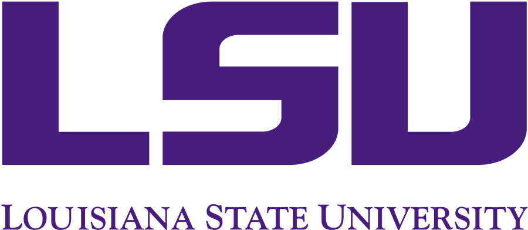

DeepFE: Deep Learning for Frog Eggs Quantification
==================================================

Over the course of the summer semester in 2023, the DeVision team has worked diligently in Math 4997 to develop a model to count frog eggs for the lab at AGGRC https://aggrc.com. Our mission was to develop software capable of accurately counting frog eggs in images using deep learning.

We embarked on this journey with the fundamental knowledge we'd gained at the beginning of the summer, which led to the creation of the initial model, referred to as the "Starter Model". This model demonstrated limitations when it came to the accuracy of predicting our test images.

In early July, one of our team members stumbled upon an existing model library named "StarDist" that was tailored to handle data similar to ours. You can find more about it here: https://github.com/stardist/stardist. We decided to pursue this library in an effort to solve our problem of counting eggs.

The first iteration of our model, which incorporated a dataset of merely 17 images, yielded surprising results in terms of its predictive capabilities. Encouraged by this outcome, we set out to further enhance and refine the model. The second, more refined iteration of the model utilizes a significantly larger dataset, with a total of 180 images.

To gauge the efficacy of our model, we introduced testing code designed to compute specific performance metrics. These metrics provide quantitative insight into the performance of the model on our dataset. They serve as an invaluable tool in our ongoing efforts to understand, validate, and optimize our model's predictive abilities.

In the end, we were able to obtain predictions of up to 99.3% accuracy.

---

Made by the DeVision Team
=========================

Dr. Peter Wolenski
------------------
wolenski@math.lsu.edu

Mathematics Graduate Students:
-----------------------

David Agbolade, Gyaneshwar Agrahari, Kiran Bist, Hayden Bromley, Jackson Knox, Monika Pandey, Iswarya Sitiraju, Gowri Priya Sunkara

Undergraduate Students:
-----------------------

Narek Bayramyan, Addison DeBlieux, Rohan Durgum, Atif Iqbal, Steph Moore, Artem Mukhamedzianov, Sunella Ramnath, Sahithi Rampally, Houston Smith, Jamar Whitfield, Skylar Wilson
 
 

LSU Math Consultation Clinic: 
https://www.math.lsu.edu/courses/capstone_course
 
 

https://lsu.edu/
